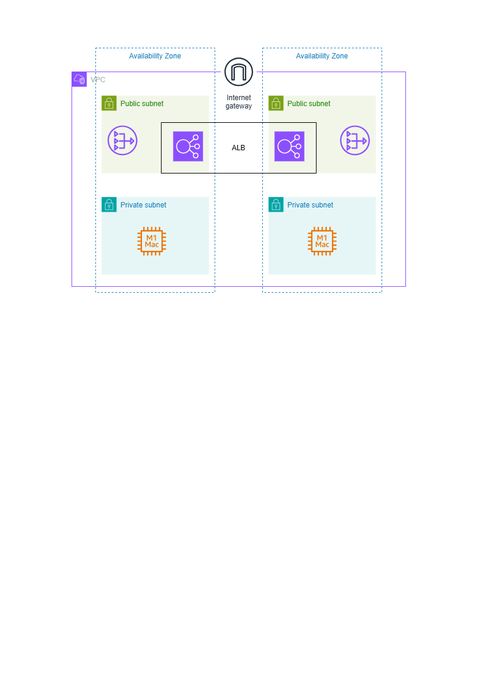

1.Project Overview
This Virtual Private Cloud (VPC) setup is designed to create a secure, scalable environment on AWS. It includes private web servers, access via a bastion host, and load balancing for efficient traffic distribution, combining security and high availability.

Purpose of the VPC Setup
This VPC architecture aims to:

Isolate network resources: Keep key resources private and secure.
Allow controlled internet access: Use a bastion server to securely access private instances without exposing them directly to the internet.
Distribute traffic efficiently: Use a load balancer to manage incoming traffic and balance the load across multiple private instances.
Key Components
VPC (Virtual Private Cloud):

Provides a secure, private environment for hosting resources on AWS.
Configured with a defined IP range for organizing resources.
Subnets:

Public Subnet: Hosts the bastion server, allowing secure access to private resources.
Private Subnet: Hosts the EC2 instances running web servers, keeping them isolated from direct internet access.
Internet Gateway:

Attached to the VPC, providing internet access to the public subnet and the bastion server.
NAT Gateway:

Allows private subnet instances to initiate internet access (e.g., for updates) without being exposed to the internet.
Bastion Host:

An EC2 instance in the public subnet, providing a secure entry point to access and manage private EC2 instances.
EC2 Instances:

Two instances in the private subnet, each configured with a web server, accessible only through the bastion host.
Load Balancer:

Balances incoming traffic between the private EC2 instances, ensuring high availability and load distribution.
Security Groups:

Firewall rules control access to each component, ensuring that public and private resources have appropriate security boundaries.
This setup is a robust AWS environment, prioritizing security through private subnets and controlled access, while ensuring performance and scalability with a load balancer for efficient traffic management.

2. Architecture Diagram

3. Setup Steps
Document the configuration process step-by-step:

VPC Creation: Describe the setup of your custom VPC, including the CIDR block and naming conventions.
Subnet Configuration:
Create public subnets for internet-accessible resources.
Create private subnets for internal resources, explaining how they differ from public subnets.
Internet Gateway and NAT Gateway Configuration:
Attach an Internet Gateway to the VPC for public subnet internet access.
Set up a NAT Gateway (if needed) in a public subnet, explaining its purpose and connection to the private subnets.
Security Groups:
Document the rules set for each security group, such as allowing HTTP/HTTPS and SSH in the public subnets and more restricted access for private resources.
Route Table Settings:
Describe the route tables linked to each subnet, showing which routes provide access to the Internet Gateway or NAT Gateway.    

4. Usage
Provide instructions on how to use the VPC setup:

Deploying: Outline any specifics on launching instances or deploying applications in public or private subnets.
Testing: Explain how to verify connectivity, such as SSH access to public instances, and how private instances access the internet through the NAT Gateway.
Access Control: Provide instructions on connecting to instances in private subnets, potentially via a bastion host in a public subnet.